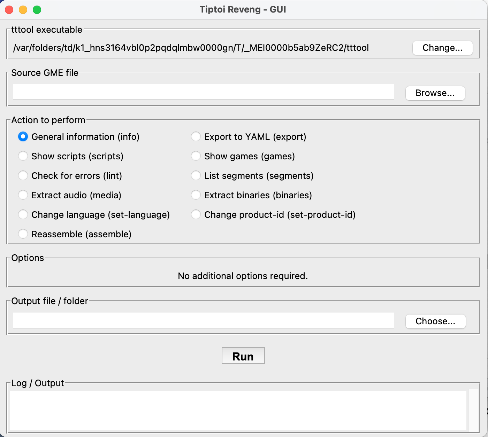

# tiptoi-reveng-gui

A graphical interface for working with the [tiptoi reverse-engineering ecosystem](https://github.com/entropia/tip-toi-reveng). The project is maintained by **Rokai-Jibe** and is intended to make common inspection, conversion, and development tasks more approachable than a command-line-only workflow.

## Download

Packaged builds are published on the [GitHub Releases page](https://github.com/Rokai-Jibe/tiptoi-reveng-gui/releases). Choose the asset for your platform:

- [macOS download](https://github.com/Rokai-Jibe/tiptoi-reveng-gui/releases) — look for the macOS archive or installer.
- [Windows download](https://github.com/Rokai-Jibe/tiptoi-reveng-gui/releases) — look for the Windows installer or `.zip` archive.

If no packaged asset is available for your platform, [run the application from source](#building-from-source).

## Features

- Desktop-oriented graphical workflow for tiptoi reverse-engineering tasks.
- Project/file selection instead of repeatedly entering long command-line paths.
- Clear display of task progress, diagnostics, and errors.
- Support for inspecting and organizing project assets used by tiptoi content workflows.
- Cross-platform documentation for macOS, Windows, and Linux.
- A focused interface that can complement the upstream `tip-toi-reveng` tools rather than replacing them.

## Screenshots



## Requirements

Before installing, make sure you have:

- Git, if installing from source.
- The runtime and dependencies required by the version of `tiptoi-reveng-gui` you are using.
- The upstream tiptoi tools required by the workflow you intend to run.
- Read/write access to the directory containing your working files.

The repository's dependency manifest and release notes are the authoritative source for the exact runtime version and third-party packages. If a packaged release is available, it is generally the simplest installation method.

## Installation

For most users, download the latest packaged build from the [Releases page](https://github.com/Rokai-Jibe/tiptoi-reveng-gui/releases) and follow the platform-specific instructions below.

### macOS

#### Packaged release

1. Open the [macOS releases](https://github.com/Rokai-Jibe/tiptoi-reveng-gui/releases) and download the macOS archive or installer.
2. Open the downloaded file. If it is an archive, extract it first.
3. Move `tiptoi-reveng-gui` to `Applications` (or another trusted location).
4. On first launch, macOS may ask you to confirm that you want to open an application downloaded from the internet. Verify the download source before approving it.

#### Run from source

```bash
git clone https://github.com/Rokai-Jibe/tiptoi-reveng-gui.git
cd tiptoi-reveng-gui
```

Install the dependencies using the command documented by the repository's dependency manifest, then start the application using the project's documented development command:

```bash
# Use the command defined by the repository; do not mix package managers.
<install-dependencies>
<start-application>
```

### Windows

#### Packaged release

1. Open the [Windows releases](https://github.com/Rokai-Jibe/tiptoi-reveng-gui/releases) and download the Windows installer or `.zip` archive.
2. Run the installer, or extract the archive to a folder such as `C:\Program Files\tiptoi-reveng-gui`.
3. Start the application by opening the executable TiptoiRevengGUI.exe
4. If Windows Defender SmartScreen displays a warning, confirm the publisher and download source before continuing.

#### Run from source

Install Git and the runtime required by the repository, then open PowerShell:

```powershell
git clone https://github.com/Rokai-Jibe/tiptoi-reveng-gui.git
Set-Location tiptoi-reveng-gui
```

Install dependencies and launch the application with the commands specified by the repository's dependency manifest:

```powershell
# Use the command defined by the repository; do not mix package managers.
<install-dependencies>
<start-application>
```

### Linux

#### Run from source

```bash
git clone https://github.com/Rokai-Jibe/tiptoi-reveng-gui.git
cd tiptoi-reveng-gui
```

Install any system libraries and project dependencies required by the selected release, then launch it using the repository's documented command:

```bash
# Replace these placeholders with the project's actual commands.
<install-dependencies>
<start-application>
```

On minimal Linux installations, a desktop environment and the GUI toolkit used by the project may need to be installed separately.

## Building from source

The platform-specific source instructions above show how to clone the repository. For the exact build, dependency, packaging, and development commands, follow the repository's dependency manifest and build configuration. This avoids prescribing commands that may become outdated as the implementation changes.

Before opening a pull request, run the project's formatter, linter, tests, and platform-specific build checks where available.

## Usage

1. **Create a working copy.** Keep original books, audio, and binary files unchanged. Work on a copy so that experiments can be reverted.
2. **Open the application.** Launch `tiptoi-reveng-gui` from your application menu, release folder, or development environment.
3. **Select a project or input directory.** Choose the directory containing the files you want to inspect or process.
4. **Review the detected files.** Confirm that the application is showing the intended input files and that the output directory is not the source directory unless you explicitly intend to overwrite files.
5. **Choose an operation.** Select the available inspection, conversion, export, assembly, or related workflow action.
6. **Review the output.** Read the log and diagnostics panel. Treat warnings as actionable, especially when working with existing products.
7. **Test with a copy of the target media or device.** Do not use irreplaceable originals during development.

### Recommended project layout

A separate layout makes it easier to reproduce and review work:

```text
my-tiptoi-project/
├── input/          # Unmodified source files
├── work/           # Intermediate files
├── output/         # Generated files
├── notes/          # Research notes and metadata
└── README.md       # Project-specific notes
```

### Troubleshooting

- **The application does not start:** verify the runtime, GUI libraries, and project dependencies required by the release.
- **A tool cannot be found:** confirm that the upstream tool is installed and that its executable is available on `PATH`, or configure its full path in the application if supported.
- **Files are missing:** check that the selected directory is the project root or the directory expected by the operation.
- **Permission errors occur:** choose a writable working/output directory and avoid protected system folders.
- **Output is unexpected:** restore from the original input copy, review the application log, and reproduce the issue with the smallest possible example.

When reporting a problem, include the operating system, application version or commit, reproduction steps, relevant log output, and a sanitized sample project if it can be shared legally.

## Contributing

Contributions are welcome. Please keep changes focused, reviewable, and compatible with the project's supported platforms.

1. Fork the repository and create a topic branch:

   ```bash
   git checkout -b feature/short-description
   ```

2. Make the smallest change that solves the problem.
3. Add or update tests and documentation where appropriate.
4. Run the repository's formatter, linter, and test suite before opening a pull request.
5. Describe the problem, the approach, testing performed, and any platform-specific behavior in the pull request.

Please do not include copyrighted books, audio, firmware, or other proprietary material in commits or issue attachments unless you have permission to redistribute it. Avoid submitting personal data, device identifiers, or complete proprietary product dumps.

### Commit and pull-request guidance

- Use clear, imperative commit messages.
- Keep unrelated refactors out of feature or bug-fix pull requests.
- Explain breaking changes and migration steps.
- Update screenshots, examples, and this README when user-visible behavior changes.
- Be respectful and assume good intent in project discussions.

## License

The applicable license is the license provided with this repository in [`LICENSE`](LICENSE). If that file is not present, the licensing terms have not been specified in this README; contact **Rokai-Jibe** before redistributing or incorporating the code into another project.

The project may interact with third-party software and user-provided content that have separate licenses and terms. This project does not grant permission to redistribute copyrighted tiptoi products, audio, firmware, or other proprietary assets.

## Acknowledgments

- The contributors to [entropia/tip-toi-reveng](https://github.com/entropia/tip-toi-reveng), whose research and tooling provide important context for tiptoi reverse engineering.
- The open-source runtime, GUI toolkit, parsers, libraries, and packaging tools used by this project. See the repository's dependency manifests for the complete list and applicable licenses.
- The tiptoi reverse-engineering community for documenting file formats, hardware behavior, and reproducible research.
- Ravensburger, the creator of the tiptoi product family, for the original product concept. This project is independent and is not affiliated with or endorsed by Ravensburger.

## Disclaimer

Use this software responsibly and only with hardware, files, and content that you own or are authorized to examine. Reverse engineering may be restricted by local law, contract, or product terms. You are responsible for complying with applicable rules and for keeping backups of your data.
